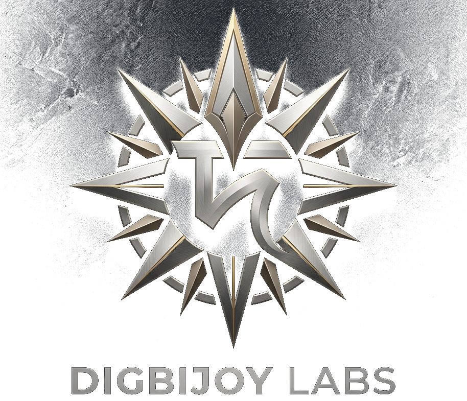
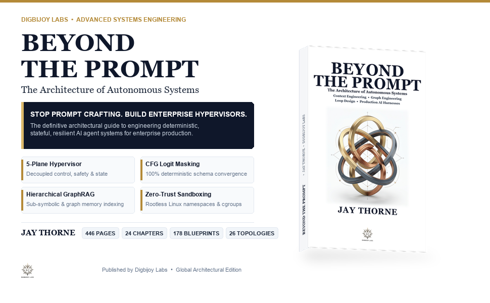
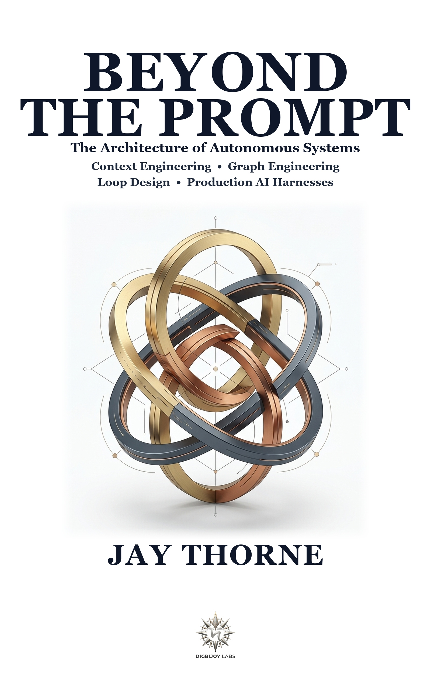
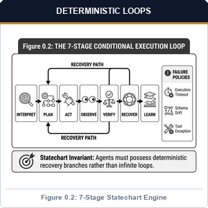
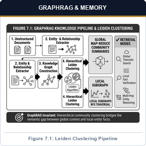
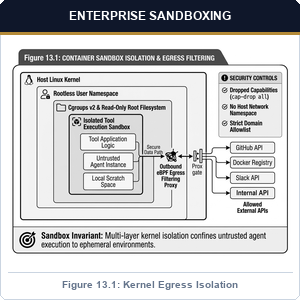
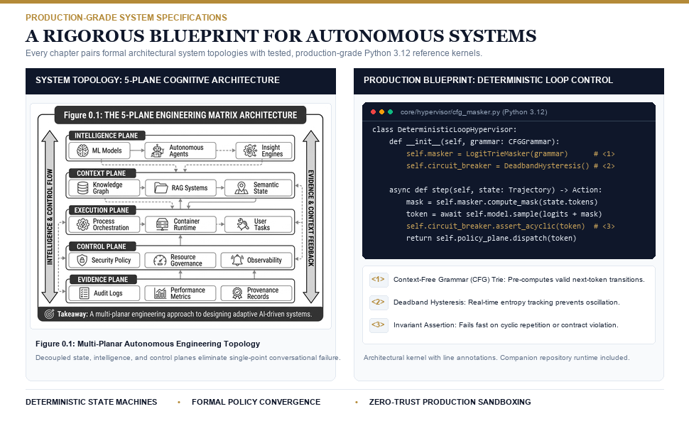
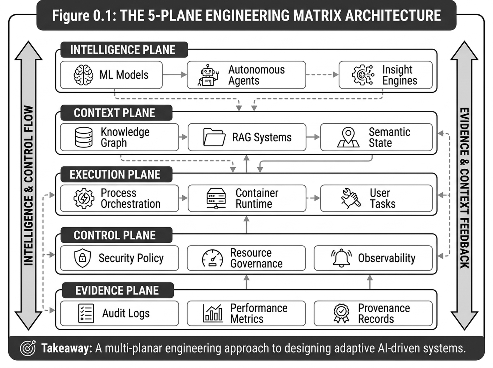
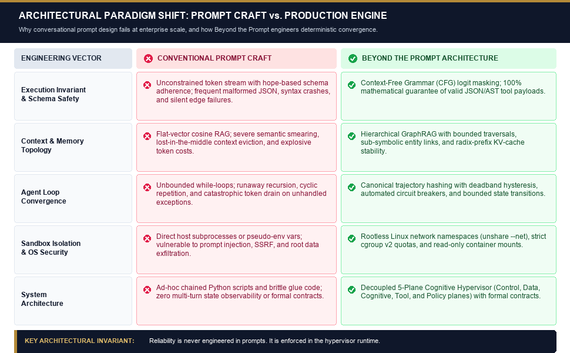

<p align="center">
  <a href="https://digbijoylabs.com" target="_blank">
    
  </a>
</p>

<h1 align="center">Beyond the Prompt</h1>
<h3 align="center">The Architecture of Autonomous Systems</h3>
<p align="center">
  <em>Context Engineering, Graph Engineering, Loop Design, and Production AI Harnesses</em>
</p>

<p align="center">
  <strong>Jay Thorne</strong> &nbsp;|&nbsp; Published by <a href="https://digbijoylabs.com" target="_blank"><strong>Digbijoy Labs Publications</strong></a> (2026)
</p>

<p align="center">
  <a href="https://github.com/digbijoylabs/beyond-the-prompt/actions/workflows/ci.yml"></a>
  <a href="https://www.python.org/downloads/"></a>
  <a href="https://pydantic.dev"></a>
  <a href="https://modelcontextprotocol.io"></a>
  <a href="https://opentelemetry.io"></a>
  <a href="LICENSE"></a>
</p>

<p align="center">
  
</p>

---

## 📖 Book Overview & Editorial Showcase

<table>
  <tr>
    <td width="36%" align="center" valign="top">
      
      <br><br>
      <a href="https://digbijoylabs.com" target="_blank">
        
      </a>
      <br><br>
      <sub><strong>Available Editions</strong>:<br>Paperback (7"×10") • Hardcover Case-Laminate • Kindle eBook</sub>
    </td>
    <td width="64%" valign="top">
      <h3>The Definitive Systems Engineering Manual for Autonomous AI Agents</h3>
      <p>
        <strong>Prompt engineering has hit its mathematical ceiling.</strong> When software architects wire unconstrained probabilistic language models directly into production APIs, databases, and financial systems, probabilistic schema drift, unbounded recursive loops, memory rot, and uncontained side-effects compound into catastrophic failures.
      </p>
      <p>
        <strong><em>Beyond the Prompt</em></strong> establishes a rigorous distributed-systems foundation for agentic engineering. Rather than treating foundation models as conversational oracles, this volume treats the large language model as an <strong>untrusted, probabilistic CPU</strong> operating inside a hardened, deterministic runtime system governed by an engineered <strong>AI Harness</strong>.
      </p>
      <ul>
        <li><strong>446 Pages</strong> of rigorous, zero-fluff distributed systems architecture.</li>
        <li><strong>24 In-Depth Chapters</strong> organized into 6 formal architectural parts.</li>
        <li><strong>26 Monochromatic O'Reilly-Style Schematics</strong> illustrating isolation boundaries and topologies.</li>
        <li><strong>178 Production Reference Blueprints</strong> in modern Python 3.12+ and Pydantic v2.</li>
        <li><strong>The 2026 Multipolar AI Landscape</strong>: Fully integrates Anthropic Mythos & Claude 5, OpenAI GPT-6 Astra, DeepMind Gemini 3.8, DeepSeek-V4 Pro/R1, Alibaba Qwen 3.8 Max, Zhipu GLM-5.3, and Mistral Large 3.</li>
      </ul>
      <p>
        🌐 <strong>Publisher Portal & Errata</strong>: <a href="https://digbijoylabs.com" target="_blank">digbijoylabs.com</a>
      </p>
    </td>
  </tr>
</table>

---

## 🌟 Core Architectural Pillars (Amazon A+ Showcase)

<table>
  <tr>
    <td width="33%" align="center" valign="top">
      
      <h4>1. Deterministic Loops & Statecharts</h4>
      <p align="left">
        Replace fragile linear ReAct loops with formal 7-stage directed statecharts. Incorporates cryptographically damped sliding windows, oscillation circuit breakers, and bounded evaluator-optimizer reflexion loops.
      </p>
    </td>
    <td width="33%" align="center" valign="top">
      
      <h4>2. Context as Virtual Memory</h4>
      <p align="left">
        Treat GPU context windows as active RAM hierarchies. Explores RadixAttention prefix caching stabilization, hierarchical compaction cascades, and ontology-driven GraphRAG for multi-hop semantic reasoning.
      </p>
    </td>
    <td width="33%" align="center" valign="top">
      
      <h4>3. Micro-Sandboxes & Protocol ACIs</h4>
      <p align="left">
        Contain untrusted execution with authentic OS primitives: rootless Linux network namespaces, cgroups v2, process-group isolation, and full compliance with the Model Context Protocol (MCP 2026-07-28) standard.
      </p>
    </td>
  </tr>
</table>

---

## 📐 Interior Schematics & System Topologies

<p align="center">
  
</p>

Every architectural diagram in the book conforms to the premier monochromatic grayscale standard (exemplified by O'Reilly and Addison-Wesley): high-legibility sans-serif typography, crisp 2px monoline iconography, clean orthogonal connectors, and zero hallucinated tokens.

### The 5-Plane Cognitive Runtime Matrix (Figure 0.1 / Figure 1.1)

<p align="center">
  
</p>

<p align="center">
  
</p>

| Architectural Plane | Operational Mandate | Key Technologies & Primitives in Companion Code |
| :--- | :--- | :--- |
| **1. Intelligence Plane** | Probabilistic reasoning & candidate action generation | Frontier SLMs/LLMs, TTC search, grammar constraints (`core/intelligence/`) |
| **2. Context Plane** | Virtual memory management & token stream assembly | Prefix KV-cache, compaction cascades, GraphRAG (`core/context/`, `core/graph/`) |
| **3. Execution Plane** | Deterministic actuation & environment interaction | MCP clients/servers, microVM sandboxes, external APIs (`core/protocols/`, `core/sandbox/`) |
| **4. Control Plane** | Invariant enforcement & workflow coordination | Deterministic statecharts, PDP gates, circuit breakers (`core/runtime/`, `core/governance/`) |
| **5. Evidence Plane** | Observability, telemetry & cryptographic auditing | OpenTelemetry GenAI spans, structured logs, audit trails (`core/sre/`, `core/durable/`) |

---

## ⚡ The 7-Stage State Graph Reference Pattern

Rather than naive linear prompt chains, *Beyond the Prompt* formalizes autonomous task execution as a 7-stage directed state graph:

$$\text{Interpret} \longrightarrow \text{Plan} \longrightarrow \text{Act} \longrightarrow \text{Observe} \longrightarrow \text{Verify} \longrightarrow \text{Recover} \longrightarrow \text{Learn}$$

Every stage is governed by strict schema coercion, hardware-timed timeouts, and cryptographic cycle detectors to eliminate infinite loop traps.

---

## 📂 Repository Layout

```
beyond-the-prompt/
├── assets/images/                       # Book cover, A+ content banners, and schematics
├── core/                                # Verified production runtime kernels
│   ├── runtime/harness.py               # Deterministic Execution Harness (Ch 1)
│   ├── intelligence/cognitive_router.py # Budget-Aware Inference Engine (Ch 2)
│   ├── gateway/model_gateway.py         # Multi-Provider Failover Gateway (Ch 3)
│   ├── tools/tool_registry.py           # Grammar-Constrained Tool Coercion (Ch 4)
│   ├── context/prefix_compiler.py       # Static KV Prefix Cache Governor (Ch 5)
│   ├── context/compaction_cascade.py    # Recursive Context Compaction (Ch 6)
│   ├── graph/graph_rag_engine.py        # Knowledge Graph & Multi-Hop Traversal (Ch 7)
│   ├── memory/hybrid_memory_substrate.py# Tiered Working/Episodic/Fact Memory (Ch 8)
│   ├── flow/statechart.py               # Guarded Statechart DAG Engine (Ch 9)
│   ├── reasoning/mcts_planner.py        # Test-Time Compute (TTC) Rollout Search (Ch 10)
│   ├── loop/self_correction.py          # Grounded Evaluator-Optimizer Reflexion (Ch 11)
│   ├── governance/loop_governor.py      # Oscillation Damping & Cycle Arrest (Ch 12)
│   ├── sandbox/process_sandbox.py       # OS Process Group Sandbox (Ch 13)
│   ├── protocols/mcp_server.py          # Model Context Protocol (MCP) Host (Ch 14)
│   ├── aci/workspace_controller.py      # Safe Agent-Computer Interface (Ch 15)
│   ├── durable/temporal_state.py        # Event-Sourced Journal State Store (Ch 16)
│   ├── protocols/a2a_messaging.py       # Agent-to-Agent (A2A) Message Envelope (Ch 17)
│   ├── multiagent/subagent_pool.py      # Ephemeral Subagent Worker Isolation (Ch 18)
│   ├── hitl/authorization_gate.py       # Two-Phase Policy Decision Point (Ch 19)
│   ├── spec/executable_spec.py          # Spec-Driven Executable Prompt Engine (Ch 20)
│   ├── security/zero_trust_guard.py     # Prompt Injection & Canary Filter (Ch 21)
│   ├── evals/eval_runner.py             # Deterministic Trajectory Benchmarks (Ch 22)
│   ├── sre/telemetry.py                 # OpenTelemetry GenAI Cost/Latency Tracker (Ch 23)
│   └── compound/flywheel.py             # DSPy-style Exemplar Flywheel (Ch 24)
├── chapters/                            # Runnable chapter demonstrations & guides
│   ├── part1_paradigm_shift/            # Chapters 1–4 Walkthroughs
│   ├── part2_context_graph/             # Chapters 5–8 Walkthroughs
│   ├── part3_flow_loops/                # Chapters 9–12 Walkthroughs
│   ├── part4_protocols_runtime/         # Chapters 13–16 Walkthroughs
│   ├── part5_multi_agent_swarms/        # Chapters 17–20 Walkthroughs
│   └── part6_eval_security/             # Chapters 21–24 Walkthroughs
├── tests/                               # Comprehensive automated test suite (10/10 passing)
├── .github/workflows/ci.yml             # GitHub Actions CI for Python 3.12+
├── ERRATA.md                            # Living errata & architecture changelog
├── LICENSE                              # MIT License (Digbijoy Labs)
└── pyproject.toml                       # Python 3.12+ PEP 621 packaging
```

---

## 🚀 Quickstart

### 1. Prerequisites
- Python 3.12 or higher
- Git

### 2. Installation
Clone the repository and install dependencies:

```bash
git clone https://github.com/digbijoylabs/beyond-the-prompt.git
cd beyond-the-prompt
python -m pip install --upgrade pip
pip install -r requirements.txt
```

### 3. Run the Automated Test Suite
Verify that all architectural kernels and invariants execute with zero failures:

```bash
pytest -v tests/
```

### 4. Run Chapter Demonstrations
Execute any chapter reference blueprint directly:

```bash
# Part 1: Deterministic Execution Harness & Oscillation Damping
python -m chapters.part1_paradigm_shift.example_harness

# Part 2: Context Compaction & GraphRAG Knowledge Graph Traversal
python -m chapters.part2_context_graph.example_graphrag

# Part 4: Model Context Protocol (MCP 2026-07-28) Host Server
python -m chapters.part4_protocols_runtime.example_mcp_client
```

---

## 🌐 The 2026 Multipolar AI Landscape

All blueprints and harness architectures in this repository reflect the genuine multipolar frontier of artificial intelligence:

| Category | Premier Foundation Systems | Substrates Supported |
| :--- | :--- | :--- |
| **Frontier Reasoning** | Anthropic Mythos / Claude 5, OpenAI GPT-6 Astra, DeepMind Gemini 3.8 | Public Cloud API & Micro-Sandboxes |
| **Open-Source & Sovereign** | DeepSeek-V4 Pro / R1, Alibaba Qwen 3.8 Max, Zhipu GLM-5.3, Mistral Large 3 | Ascend NPUs, Apple Silicon (MLX), AMD ROCm, NVIDIA CUDA |
| **Protocol Standards** | Model Context Protocol (MCP 2026-07-28), OpenTelemetry GenAI Semantic Conventions | JSON-RPC 2.0 over stdio/SSE, gRPC, REST |

---

## 📖 Book Information & Citation

If you reference this work, utilize the companion code, or cite its architectural frameworks in academic papers or industrial whitepapers:

```bibtex
@book{thorne2026beyondtheprompt,
  author    = {Jay Thorne},
  title     = {Beyond the Prompt: The Architecture of Autonomous Systems},
  subtitle  = {Context Engineering, Graph Engineering, Loop Design, and Production AI Harnesses},
  publisher = {Digbijoy Labs Publications},
  year      = {2026},
  pages     = {446},
  isbn      = {Pending / Official Release},
  url       = {https://github.com/digbijoylabs/beyond-the-prompt}
}
```

---

## 🏢 About Digbijoy Labs & the Author

- **Jay Thorne** is a systems architect and autonomous systems engineer specializing in cognitive execution runtimes, context engineering, and the production infrastructure required to run agentic AI at enterprise scale.
- **Digbijoy Labs Publications** is an advanced AI systems research lab and engineering publishing imprint dedicated to publishing definitive, non-fiction engineering manuals and reference architectures.
- **Official Portal**: [https://digbijoylabs.com](https://digbijoylabs.com)
- **Errata Submissions**: Submit discrepancies directly via [GitHub Issues](https://github.com/digbijoylabs/beyond-the-prompt/issues) or consult [ERRATA.md](ERRATA.md).

---

## 📄 License

The code and reference blueprints in this repository are licensed under the [MIT License](LICENSE).  
Copyright (c) 2026 Jay Thorne & Digbijoy Labs Publications.
